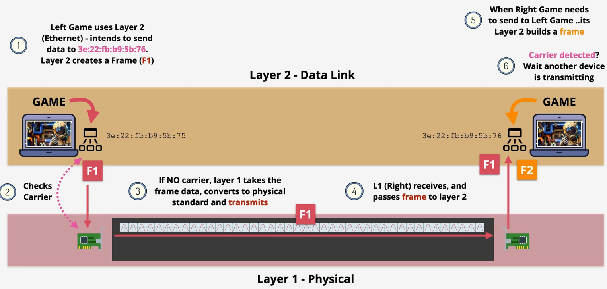
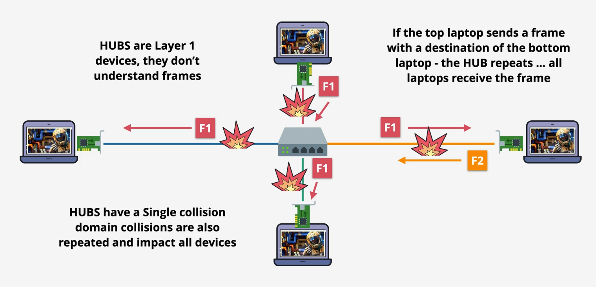

# Networking

## OSI 7 layer model
|                  |
| ---------------  |
| 7 - Application  |
| ---------------  |
| 6 - Presentation |
| ---------------  |
| 5 - Session      |
| ---------------  |
| 4 - Transport    | 
| ---------------  |

|                  |
| ---------------  | 
| 3 - Networking   |
| ---------------  |
| 2 - Data Link    |
| ---------------  |
| 1 - Physical     |
| ---------------  |

1. Layers 1 - 3 are the ```media layers```. This is how data moves from point A to point B.
2. Layers 4 - 7 are the ```host layers```. This is how data is chopped up, readied for transport, and reassembled.
    * At the top you may have a web browser connected to a server
    * At the bottom you'll have network cards

## Layers

### Physical - Layer 1
1. This is about voltage levels, distances, modulation and connectors. Imagine two computers connected with a (copper) LAN line, the physical shared medium. It can also be fibre or wifi.
2. This is how two NICs (that share the same standards) communicate at layer 1.
3. Looking ahead, layer 1 only has layer 1 capability whereas layer 2 has layer 1 and 2, and...layer 3 has layers 1, 2, and 3 capability.
4. Hubs are layer 1 devices. 
5. The problem with layer 1: errors and collisions. Why? Because the traffic is broadcasted. It would be like several people yelling at the same time.  Only one device can communicate at a time. There's no device addressing. 

### Data Link - Layer 2
1. This runs over layer 1 networks: copper, fibre, wifi, etc.
2. Layer 2 introduces frames and MAC addresses. A frame is for sending data over a layer 2 network. 
3. Every device on a network has a MAC address.  These are specific to the hardware (NIC), and are globally unique. 
4. A layer 2 frame can be transmitted onto the shared physical medium in layer 1.  It's converted into voltage, RF, or light wave across the medium and received by other devices.

     
| 1 Preamble | 2 destination Mac Address | 3 source Mac Address | 4 ET 16 bits | 5 Payload 46 - 15000 bytes | // | check |

5. Frame - multiple parts - this is what Layer 2 uses for communication
    * 1 is the preamble. It lets other devices know it's the start of the frames. 
    * 2 & 3 are the destination/source MAC address. The packet can be sent to a specific MAC address, or ff:ff:ff for a global destination. 
    * 4 is the EtherType. This is SUPER FUCKING important. The EtherType decides which layer 3 protocal (e.g., IP) is putting itselft inside a frame. Layer 3 uses layer 2 frames for device to device communication on a local network. You need to know which layer 3 protocal originally put data into that frame.
    * Parts 2, 3 and 4 are the ```Mac Header```. They indicate the destination, source, and ET. 
    * Part 5 is the payload. The payload is the data the frame carries from source to destination. It's generally provided by Layer 3, and the ET defines which L3 protocol is used; for instance, IP.
    * At the end is the check sequence to make sure no errors occured.

### Data Link Part Two
1. Assume we have two computers with known NIC addresses between them  
2. Comp A packages up a frame of data. Before sending it checks for a carrier signal on the network, via CSMA (Carrier Sense Multiple Access). If none is detected, it passes the frame to layer 1.

3. The raw data is converted to 1s and 0s in layer 1 and then goes to Comp B where it reviews the destination mac address
4. What if Comp B wants to send at the same time?  To avoid a collision it looks for ```carrier dectected```. If one is, it waits.

5. What if both sides don't detect traffic then send at the same time? A collision could accure and that's what collision detection is for. This is part of layer 2.  A collision is detected, a jam signal is sent by all the devices that detect it, and a ```random backoff``` occurs. No device will attempt a transmission.

6. Hubs behave like layer 1. They don't detect collisions. A switch is a layer 2 device, so should help. They understand MAC addresses and have a MAC address table which starts off empty.  It learns which devices are connected and populates the Mac address table.  Switches store and forward the frame.  It means only valid frames are forwarded.  Switches can be connected and scale.
    