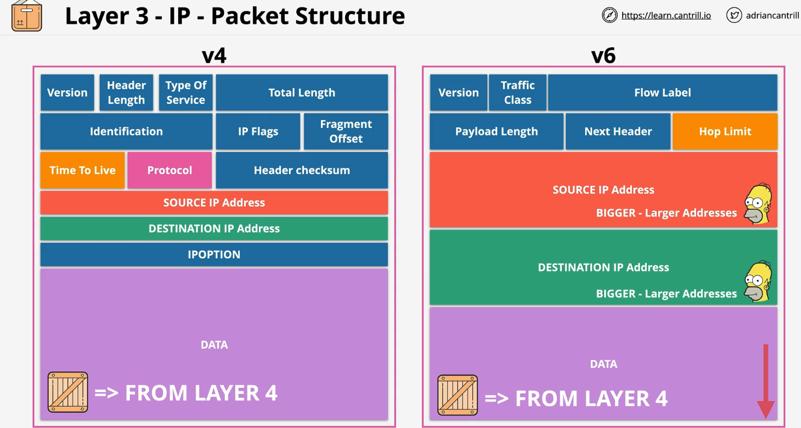
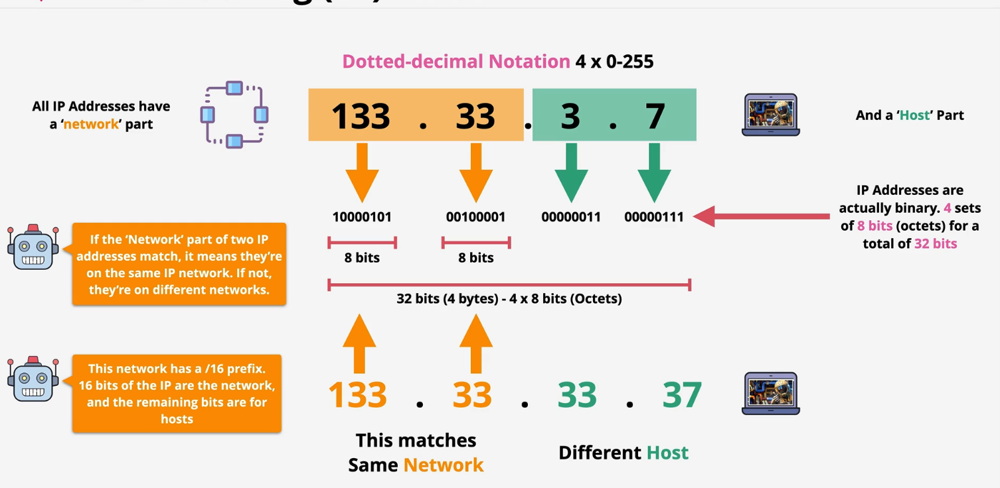

# Networking - Layer Three

## Two Separate LANs

1. L3 needs one or more operational L2 networks to function.
2. Its role is to get data from one location to another.

3. We have separate LANs. One on the east coast, one on the west coast, and some inbetween.
4. They use ```different layer 2 protocols```.  LANs often use ethernet, but long distance points may use PPP/MPLS/ATM.
5. The importance of L2 -> ```Layer 2 moves frames from a local source to a local destination```
6. The importances of L3 -> ```Layer 3 is a common protocal that span multiple different layer 2 networks.``` 

7. L3 can be added to one or more L2 networks.
8. L3 adds the Internet Protocol: IP addresses you can assign to devices for communicating across networks using routing.
9. IP packets are moved from source to destination across the Internet through many intermediate networks. 
10. Routers (L3 devices) move packets of data across different networks.  They ecapsulate a packet inside of an ethernet frame for that part of the journey over that local network.
11. Ecapsulation just means that an IP packet is put inside an ethernet frame for that part of the journey.  When it needs to be moved into an new network that particular frame is removed and a new one is added around the same packet and it's moved onto the next local network.


## Packets - The data unit used within the IP
1. Packets are similar to frames. They contain some data to be moved and they have a source/destination address.
2. The diff is that packet source/destination addresses could be on the opposite sides of the planet, not local.
3. Packets remain the same during their journey. As they move along layer 2 networks they are placed inside frames (encapsulation).
4. The frame is specific to the local network the packet is moving through and changes everytime the packet moves between networks.  The packet itself doesn't normally change.

## Two versions of the Internet Protocol. Packet Structure

 
 1. v4
 * The v4 protocol. The IP is L3 and it contains data provided by a L4 protocol. It stores which protocol is used.  Examples would be like ICMP (value 1), TCP (value 6), UDP (value 17). This L3 layer will know which L4 protocol to pass the data into.
 * The data is provided by a L4 protocol.
 * TTL or Time To Live. This defines the max number of hops a packet can take to get to its destination.  If it exceeds them, it can be discarded. 
 * A single packet may exist in several frames throughout its route to get to its destination.  One for every L2 point to point link.    

 2. v6
 * Hop Limit is like Time To Live


 ## IP Addressing - v4
 
 * If the network component of the two IP addresses match, the devices are local.  If not, they are remote.


 ## Subnet Mask
 * It's the subnet mask which allows a HOST to determine if an IP address it needs to commicate with is local or remote - which influences if it needs to use a gateway or can communicate locally.
 * They are configured on L3 interfaces along with IP addresses. 
 * A default gateway is also configured on most interfaces.  This is an IP address on the local network which packets are forwarded to generally if the intended destination is not a local IP address.
 * Subnet masks are what allow an IP to know if an IP address it needs to communicate with is on the same network or not. This influences if a device attempts to communicate directly on the local network or if it needs to use the default gateway.
 * Default Gateway Example: My Internet router is my default gateway.  When I go to Netflex or interact with AWS, because the IP addresses I'm interacting with are not local, then packets from my computer are passed to the router/default gateway.

 | IP address | 133.33.3.7 |
 | ---------  | ---------- |
 | binary | 10000101 00100001 00000011 00000111 |

 | Subnet ---   | 255.255.0.0 |
 | ---------    | ---------- |
 | binary | 11111111 11111111 00000000 00000000 |    

 * /16 is the same as saying sixteen 1's.  It means the first two octets are the network.
 * When the subnet mask is in binary, anything with 1 represents the network, anything with 0's is the host computer. 
 
* In this example the start of the network is 133.33.0.0


    
