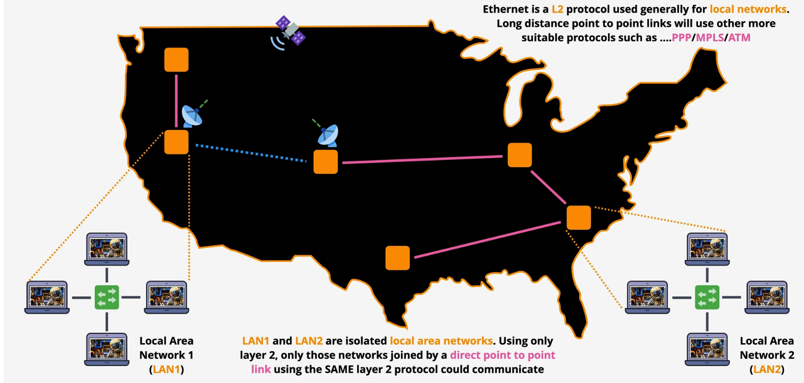

# Networking - Layer Three

## Two Separate LANs

1. L3 needs one or more operational L2 networks to function.
2. Its role is to get data from one location to another.

3. We have separate LANs. One on the east coast, one on the west coast, and some inbetween.
4. They use ```different layer 2 protocols```.  LANs often use ethernet, but long distance points may use PPP/MPLS/ATM.
5. The importance of L2 -> ```Layer 2 moves frames from a local source to a local destination```
6. The importances of L3 -> ```Layer 3 is a common protocal that span multiple different layer 2 networks.``` 

7. L3 can be added to one or more L2 networks.
8. L3 adds the Internet Protocol: IP addresses you can assign to devices for communicating across networks using routing.
9. IP packets are moved from source to destination across the Internet through many intermediate networks. 
10. Routers (L3 devices) move packets of data across different networks.  They ecapsulate a packet inside of an ethernet frame for that part of the journey over that local network.
11. Ecapsulation just means that an IP packet is put inside an ethernet frame for that part of the journey.  When it needs to be moved into an new network that particular frame is removed and a new one is added around the same packet and it's moved onto the next local network.


## Packets - The data unit used within the IP
1. Packets are similar to frames. They contain some data to be moved and they have a source/destination address.
2. The diff is that packet source/destination addresses could be on the opposite sides of the planet, not local.
3. Packets remain the same during their journey. As they move along layer 2 networks they are placed inside frames (encapsulation).
4. The frame is specific to the local network the packet is moving through and changes everytime the packet moves between networks.  The packet itself doesn't normally change.

## Two versions of the Internet Protocol. Packet Structure

|  IPV4                             | 
| ----------------------------      | 
| version | header length | type of service | total length |
| Time To Live (aka TTL), Protocol (ICMP, TCP, UDP from L4) | 
| source/destinaton IP Address      | 
| Data from L4                      |    

|  IPV6                             | 
| ----------------------------      | 
| Time To Live (aka TTL), Protocol (ICMP, TCP, UDP from L4) | 
| source/destinaton IP Address (bigger so more addresses)   | 
| Data from L4                      |   