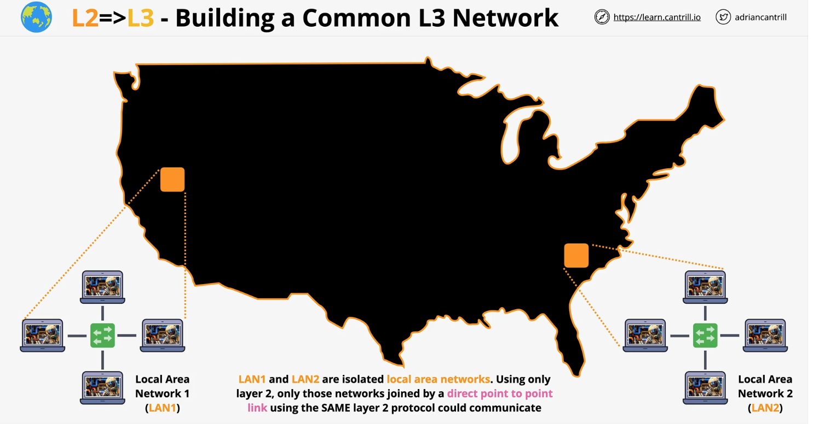

# Networking - Layer Three

## Two Separate LANs

1. We have two separate LANs. One on the east coast, one on the west coast.
2. They use ```different layer 2 protocols```.  LANs often use ethernet, but long distance points may use PPP/MPLS/ATM.
3. Not all of them use the same frames.  Recall, layer 2 moves frames.
4. ```Layer 3 can span multiple different layer 2 networks.```
