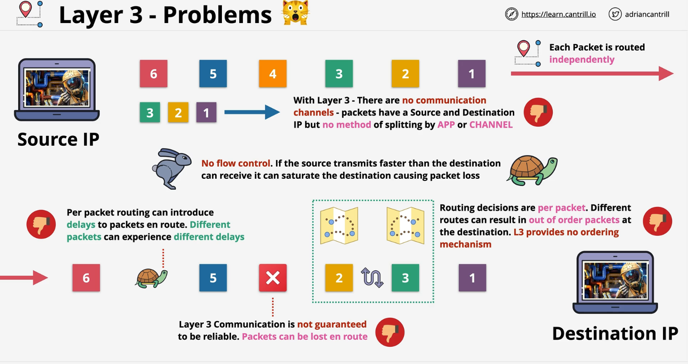

# Transport - Layer 4

The Transport layer runs over the top of the network layer and supports most of the networking we use day to day on the Internet.    

The Session layer runs on top of the transport layer and many of the features we might use are often mixed between these two layers.    

### Limitations of L3

1. In this example, the source is sending 6 packets to the destination.  All of them may arrive, but it's possible they won't arrive in order.  L3 provides no ordering mechinism. 
2. Because packets are individual, it's possible that each one take slower/faster routes. 
3. Another issue is that packets can go missing. Maybe due to power issues, network conditions, and an excessive number of hops. 
4. No way of distinguishing between the applications.  Any packet sent by one application would look to be the same sent by another.
5. IP has no flow control.  If the source transmits faster than the destination can receive, it can saturate the destination causing packet loss.