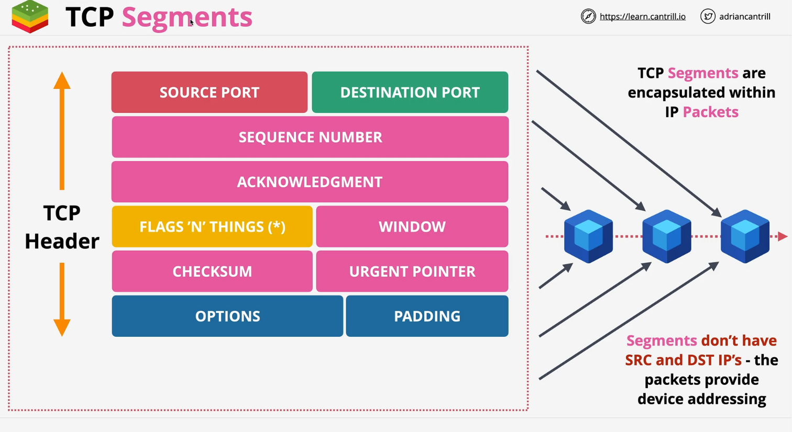
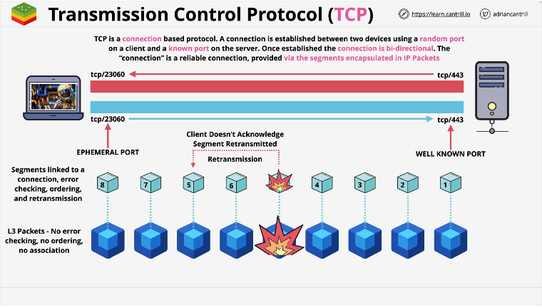

# Transport - Layer 4

The Transport layer runs over the top of the network layer and supports most of the networking we use day to day on the Internet.    

The Session layer runs on top of the transport layer and many of the features we might use are often mixed between these two layers.    

### Limitations of L3

1. In this example, the source is sending 6 packets to the destination.  All of them may arrive, but it's possible they won't arrive in order.  L3 provides no ordering mechinism. 
2. Because packets are individual, it's possible that each one take slower/faster routes. 
3. Another issue is that packets can go missing. Maybe due to power issues, network conditions, and an excessive number of hops. 
4. No way of distinguishing between the applications.  Any packet sent by one application would look to be the same sent by another.
5. IP has no flow control.  If the source transmits faster than the destination can receive, it can saturate the destination causing packet loss.

## What is L4?

1. This adds TCP (transmission control protocol) and UDP (user datagram protocol).  Both run onto of IP.
2. The term TCP/IP means TCP running on top of IP.  TCP is reliable, has error correction and does ordering of data.  It is slower though.  It's used for http, https, ssh and more.
    * It is a connection oriented protocol.  This means you need to set up a connection b/t two devices and it sets up a bi-directional channel of communication.
    * UDP is faster b/c it doesn't have the overhead required for the reliabile delivery of data.

## More about TCP

1. TCP introduces segments. Segments are another container for data like packets and frames. 
2. Segments are specific to TCP. They are encapsulated (inside) packets.
3. TCP segments are placed inside packets. Packets carry the segments from their source to destination.
    * Segments don't have source or desgination IP addresses. L3 handles that.
4. TCP adds ```source``` and ```destination``` ports. This gives the TCP/IP protocol the ability to have multiple streams of conversations at the same time between two devices. For instance, port 443. Because of ports you can have multiple streams of communcation from your machine: AWS, Netflix, and this video series.
    * Source port and Destination port are why the internet can function the way it does. It's why SSH and EC2 can exist on the same instance, why you can have mult SSH connections open to the same EC2 instance.
6. Sequence Number. It is incremented with each segment sent. It's unique and can be used for error correction if things need to be re-transmitted. It can be used to ensure when IP packets are received and the TCP segments are pulled out they can be correctly ordered. The sequencing allows both sides to make observations about it.
7. The way observations are done is through ```acknowledgment```. It's a way one side can indicate it received up to and including a certain sequence number. Every segment transmitted needs to be acknowledged on both sides. ```Sequence Number and Acknowledgment``` work hand in hand.
8. ```Flags 'n things```.  In an segment there is a flags component which is 9 bits and this allows various controls over a TCP segment. Flags are used to close the connection or synchronize sequence numbers.  
9. ```Window```.  It defines the number of bites you indicate you are willing to receive between acknowledgements. Once reached, the sender will pause until you acknowledge that amout of data.  This is how flow control is implemented.  It lets the receiver control the rate at which the sender sends data. If you use small windows it provides additional levels of control over how quickly you send data.  Larger windows are more effecient b/c the header of a TCP segment takes up an amount of space and the smaller the window the more headers are involved.
10. ```Checksum```. Used for error checking. It means the TCP layer can detect errors and arrange for re-transmitting data as required.
11. ```Urgent Pointer``` Used with data transfer applications where 99% of data is the data being transfered and 1% is controls traffic. Communication between the client and the server are coordinating the transfer.  Both sides can have separate processing so the control traffic always take priority w/in the communication: latency applications such as FTP and Telnet can use this field.
12. All of these fields are known as the ```TCP Header```.

### TCP Part 2
1. TCP like IP is use to allow communications between two devices.
2. TCP is connection based.  It provides a connection architecture between two devices: client and server. Once established the connection provides what's seen as a reliable communication channel between the client and the server which is used to exhange data. The ephemeral port is temporary.  The well known port is permanent. 
3. The communication will still use packets at L3.  Again, at L3 there is no association between packets, no ordering, no error checking and they are isolated.
4. L4 takes data provided to it and chops that data up into segments linked to a connection, error checking, ordering and retransmission and puts them into the IP packets.

