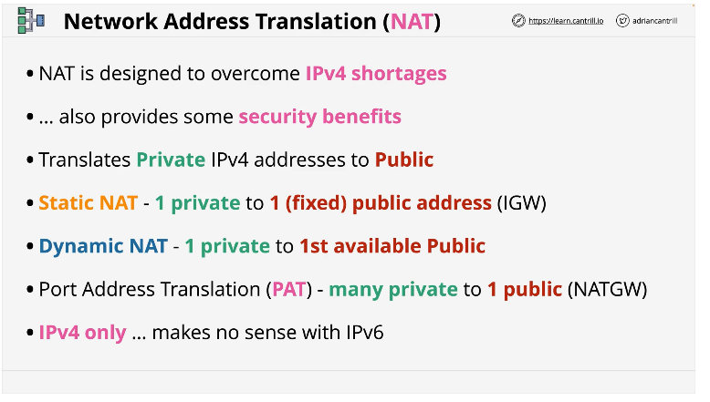
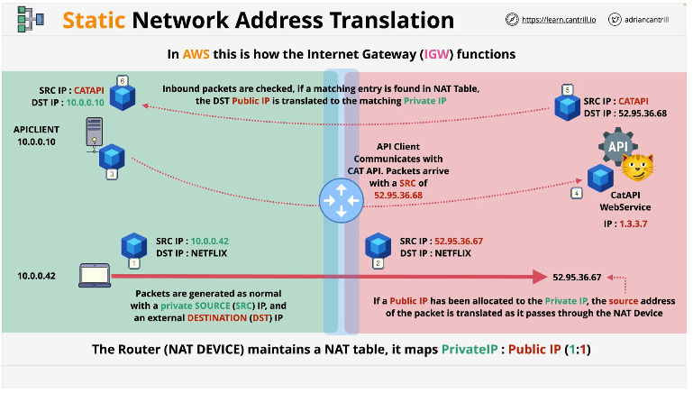
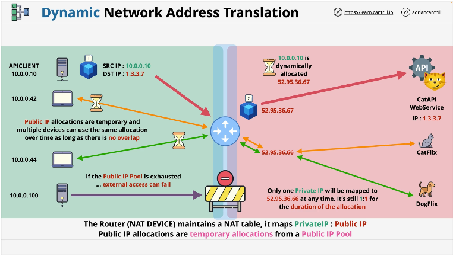
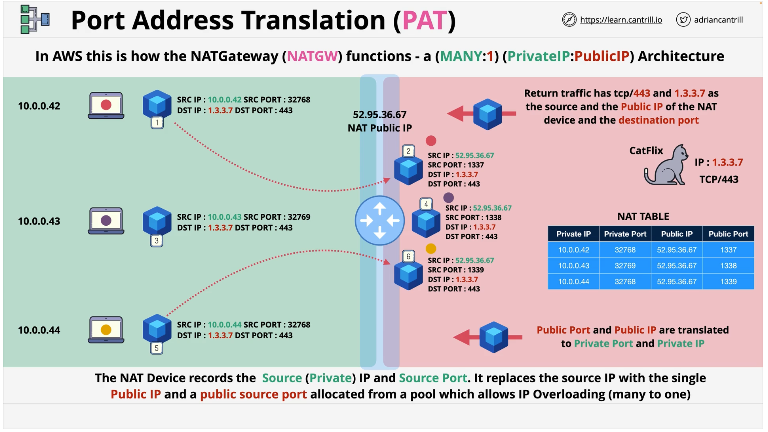

# Network Address Translation
NAT is a fundamental technology used in computer networking to allow multiple devices to share a single public IP address. This is essential for businesses and individuals who have more devices than available public IP addresses.

## Static NAT
1. The router or NAT device maintains a NAT table.  It stors a 1:1 table between public and private IPs. 

## Dynamic NAT
1. This type of NAT is used when you have less Public IP addresses than Private IP addresses, but when all of those Private  IP's need public access at some time.

## Port Address Translation PAT
1. This is the type of NAT you use on your home network. PAT is what allows a large number of devices to share one public address. It's how the AWS NAT Gateway functions w/in the AWS environment. It has a many:one mapping architecture.
2. Src port: 32768 is a randomly assigned ephemeral port. Notice how the NAT device changes the Src port number to 1337. It puts that number into a NAT table. 

