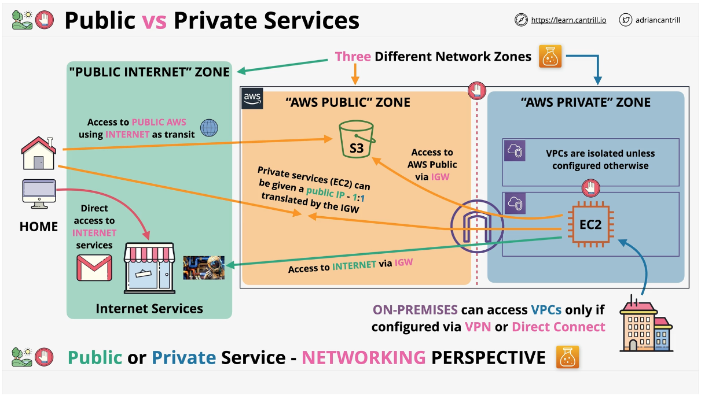

# Public Vs Private
1. AWS services can be categorized between two main types: public and private.
2. Private and Public services refer only to networking.
    * A public AWS service is accessed using public end-points such as S3. S3 can be accessed anywhere that has an Internet connection.
    * A private AWS service is something that runs within a Virtual Private Cloud (VPC). So only things w/in that VPC or what is connected to that VPC can access the service.
    * For both of these there are permissions as well as networking.  So even though S3 is a public entity, only the root user and the accounts granted access can access that resource.

## VPC's
1. VPC's are isolated unless you configure it otherwise.
2. Nothing from the Internet can reach them unless you allow it. Services like EC2 (Elastic Computing Cloud) can be put in them.

## The three zones
1. Public Internet, AWS Public Zone, AWS Private Zone.
 * Public Interent connects to AWS Public Zone.
 * On-premises networks can access VPCs
 * The upside down U is an Internet gateway. It allows private zone resources to access the public Internet as long as the EC2 has an alocated public IP address. It also allows access to public AWS services such as S3, but crucially this data doesn't touch the public Internet at any point. It communicates with the public service using the AWS Public Zone. 
 * It's possible to give private resources such as EC2 instances a public IP address and this allows the resource to be accessed from the Public Internet. Architecturally what this is doing is projecting the EC2 instance into the Public Zone so that all of that instance or part of it can be communicated with from the Public Internet. 
 