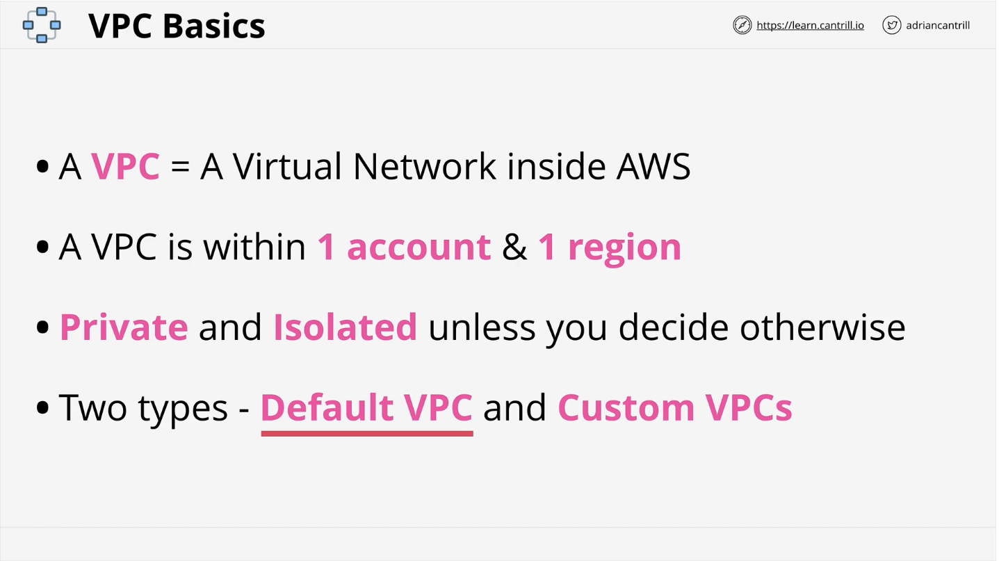
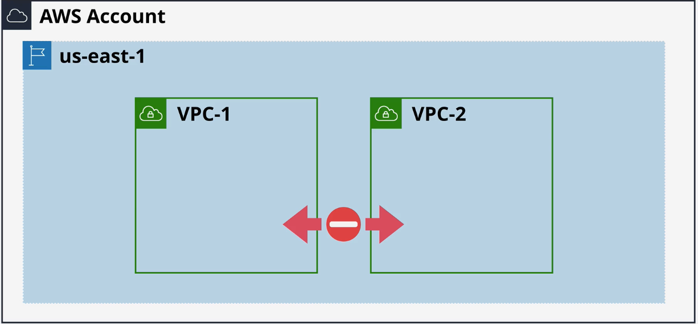
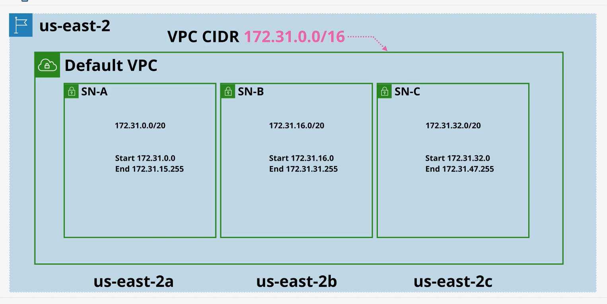

# Virtual Private Cloud basics
This is a private service for which other private services will run from.   

VPC's are also the service which is used to connect your AWS private networks to your on-premises network when creating a hybrid environment, or it's the service which lets you connect to other cloud platforms when you're creating a multi-cloud deployment.
 
 * VPC's are Region Resilient (defined in 002 notes)
 * Default VPC has a max of one per region.
    1. Initially created by AWS. ONE PER REGION BY DEFAULT
    2. They can be created and deleted, so in theory a Region could have no VPC
    3. Some services assume that a default VPC will be present. 
    4. The CIDR is always 172.31.0.0/16
    5. They come with an Internet Gateway (IGW), Security Group (SG), and NACL (network access control list)
    6. Subnets assign public IPv4 addresses
    7. They come preconfigured in a very specific way. All networking is handled by AWS
    8. They are less flexible than custom VPCs
 * Custom VPCs. Many can be in a region.
    1. Configure them anyway you want as long as you stay within the rules and limits of VPCs
    2. They require you to customize everything from end-to-end and are 100% private by default
    3. Thye are used in almost all serious AWS deployments
    4. They can be linked with other VPCs and configured to communicate with other cloud platforms and on-premises networks

1. VPCs are created within an AWS account.  More specifically an AWS Region.
2. A region can have multiple custom VPCs in it, and unless you configure it otherwise, they cannot communicate outside of their specific network

## Default VPC
1. VPCs are region resilient, but what does that mean?
2. A default VPC is given an IP range.  It's called the VPC CIDR. The default is 172.31.0.0/16.  Every default VPC gets this range.  It cannot be changed. !! Custom VPCs can have multiple CIDR ranges.
3. Everything in that CIDR uses that range.  In or Out it hits the VPC CIDR.

1. us-ease-2a/2b/2c are Availability zones, and they are subnets of the VPC CIDR. 

