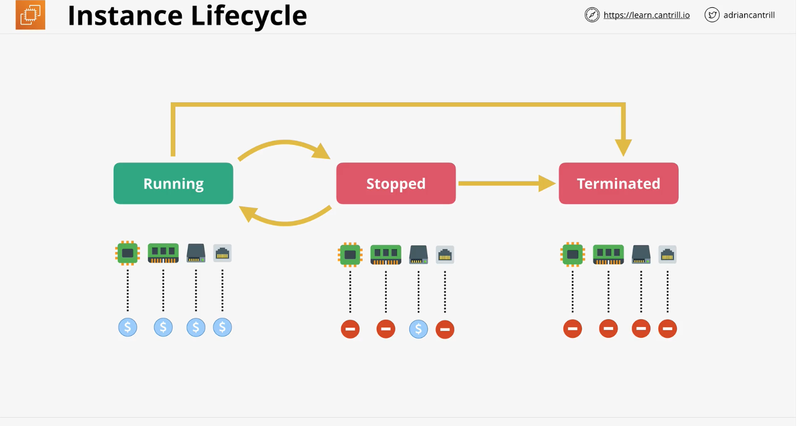

# Elastic Compute Cloud (EC2)
This is pretty much the default compute system within AWS. 

## What is it?
1. EC2 provides access to VMs known as instances
2. If you need to deploy any kind of compute that needs an operating system, run time environment, database dependencies, applications and application interfaces.  EC2 is the service to manage them.

## Important features
1. It is IaaS => Infrastructure as a Service.  It provides access to EC2 machines known as virtual instances.
2. Your unit of consumption is the instance.  An instance is just an OS configured in a certain way with a certain set of allocated resources. 
3. It's a private AWS services.  It runs in the private AwS zone.  An EC2 instance is configured to launch into a single VPC subnet.  
4. Public access has to be configured if you want it.  If so, the VPC that it is in needs to support public access.  A default VPC provides an IPv4 public address.  Custom VPC's don't.  You have to set it up.
5. EC2 is AZ Resilient. This is because an instance is launched into a specific subnet and because a subnet is in a specific AZ. If the AZ fails, the instance fails. 
6. When you launch an instance you can chouse from different sizes and capabilities.  These can be changed after launch.
7. EC2 offers on-demand billing.  It's either by the second or the hour depending on the software that is launched with the instance.
8. There is the charge for running the instance (cpu, memory), the storage, and extras for commercial software.
9. Two popular types of storage
    * Local host storage that EC2 instance runs on
    * Elastic block store. This is network storage made available to the instance. 
10. Instances lifecycle and billing

* When the instance is terminated, everything is gone from storage.