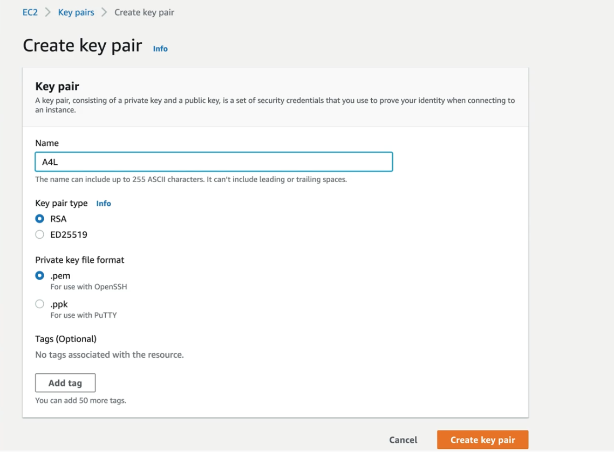

# First EC2 Instance

1. Go to the EC2 dashboard. Go to ```Network & Security > Key Pairs```
2. Create an SSH key pair.  This is how we access the EC2 instance.  
3. When creating the key pair, you only have one chance to download the key.
