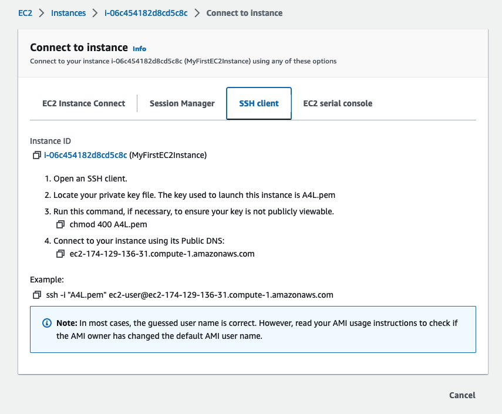

# First EC2 Instance

1. Go to the EC2 dashboard. Go to ```Network & Security > Key Pairs```
2. Create an SSH key pair.  This is how we access the EC2 instance.  
3. When creating the key pair, you only have one chance to download the key.


1. Use .pem for Linux and MacOS. 
2. After creating the EC2 key pair, the private key will be downloaded to the MacOS KeyChain Access.
3. Now go back to the EC2 dashboard to ```Instances > instances```. Select the Launch instances button.


1. Give the instance a name
2. Use the default Amazon Linux quick start
3. Select a free tier AMI, and free Instance type
4. Put in the key pair name.  This was created when making the key pair


1. Keep the default settings: Network, Subnet, Auto-assing public IP, Firewal, Allow SSH traffic, configure storage.
2. The ```Create security group``` was given the name ```launch-wizard-1``` by AWS.


Continue when you see the status check 2/2    


1. How to connect to the terminal of an EC2 instance.
2. Right click over the Instance ID and select ```connect```
3. You'll see the following dashboard    


1. EC2 Instance Connect is web based.  Session Manager isn't something I would use.
2. SSH Client. This will require the .pem key in my case.



1. To access the EC2 instance over the internet, open a terminal and go to where the .pem key was downloaded.
2. Copy the ```chmod 400 A4L.pem``` and paste into the terminal.  It will change the permissions.
3.
