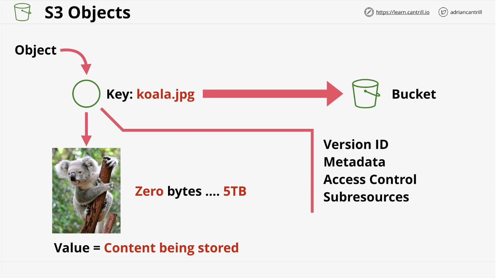

# S3 Basics
1. Global storage platform - regional based/resilient     
    * It's a public service that can be accessed anywhere with an internet connection
    * It's region based b/c your data is stored in a specific AWS region.
    * It never leaves that region unless you specifically set it up to do so.
    * It's regionally resilient b/c the data is replicated across that region.
2. It's a public service, unlimitted data & multi-user (in the millions) can access it
3. It's perfect for hosting large amounts of data (e.g., movies, audio, photos, lrg data sets, etc)
4. Economical & accessed via UI/CLI/API/HTTP
5. It should be the default starting point for storing data
6. S3 has two main things it delivers: Objects & Buckets
    * Objects: pictures, movies, large stores of data sets
    * Buckets: containers for objects

## Objects
 
 1. Think of objects as files. They have two main components and some meta data.
 2. The key identifies the object in the bucket. 
 3. The value is the data or contents of the ojbect. !!The value can range for 0 bytes to 5TB.

 ## Buckets
 
 1. Buckets are created in a specific AWS region.  This has two main impacts.
    * First, the data inside the bucket has a primary home region.  It never leaves the region unless you set it up to do so.  This means S3 has stable and controlled sovereignty. 
    * In the event of a catastrophy, the effects will be contained w/in that region.
    * !! A bucket name needs to be globally unique across all regions and all AWS accounts
    * They can hold unlimitted objects.  Infinately scalable storage system.
    * !! As an object storage system, S3 buckets have no complex structure. It's flat.  All objects are stored at the same level.
    * Folders are often referred to as prefixes in S3. They're not part of the object name, they prefix the object names.
    * Buckets are generally the default place you should go to to configure the way that S3 works.

### Summary Info
1. Bucket names are all globally unique
2. 3 - 63 characters, all lowercase, no underscores
3. Must start with lowercase letter or a number
4. Cannot be IP formatted e.g., 1.1.1.1
5. !!! Buckets have a soft limit of 100, and a 1000 hard limit per AWS account
    * You cannot implement a solution if you have 1 bucket per user if you have this amount of users
    * What you can do is take a single bucket and divide it up using prefixes (so those folders that aren't really folders), and then in that way you can have multiple users in a bucket.
6. Unlmitted objects in a bucket, 0 bytes to 5TB
7. key = Name, value = Data

## Patterns and Anti-Patterns
1. S3 is an object store.  It is not a file storage system or a block storage system.
2. If you're accessing the whole of an object such as an image or an audio file, S3 is the right choice.
3. If you have a windows server that needs to access a file-based system, then S3 is not the right choice.
4. When you deal with virtual machines or instances you mount block storage to them. Block storage is basically virtual hard disks. 
5. In EC2 you have EBS which is block storage.
6. Block storage is generally limited to one thing accessing it at a time.  One instance in the case of EBS.
7. S3 doesn't have that single user limitation and it's not block storage.  That means you cannot mount it as a drive.
8. S3 is great for large scale data storage or distribution.  It's also good for offloading things.  For instance, if you have a blog with lots of posts and images, instead of storing all that data on an expensive compute instance, you can move it to a S3 bucket and configure your software to point your uses at S3 directly.
9. S3 should be your default thought for any input to AWS services or output from AWS services.  Most services that consume data and or output data can have S3 as an option to take data from or put data to when it's finished.
10. !! Exam questions. S3 should be your first choice to store data.