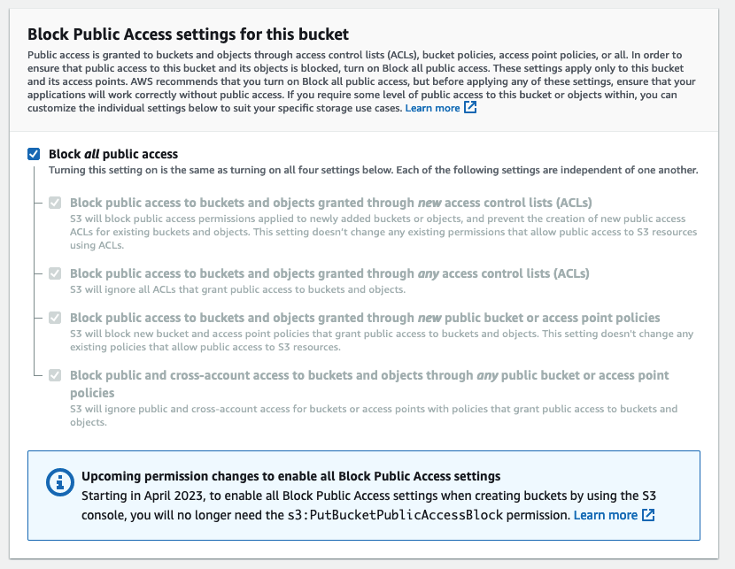
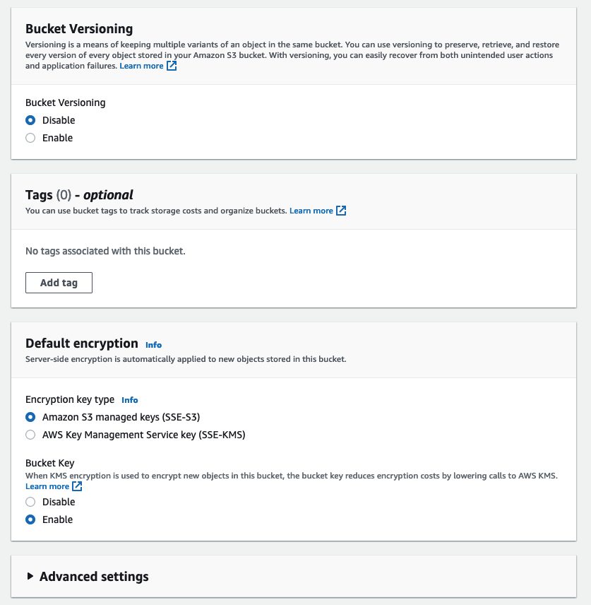
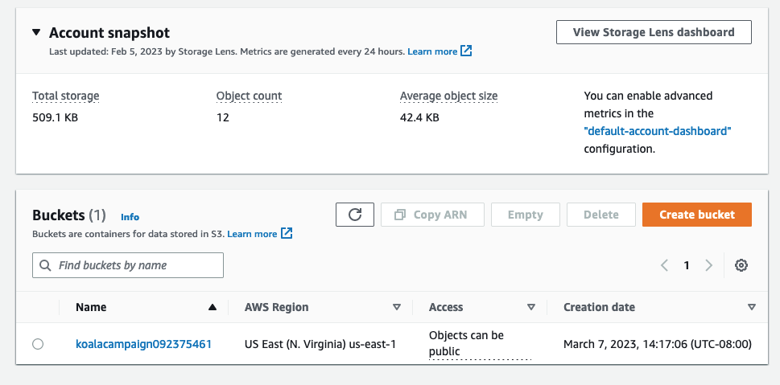
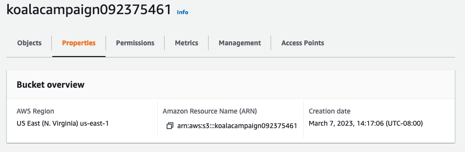
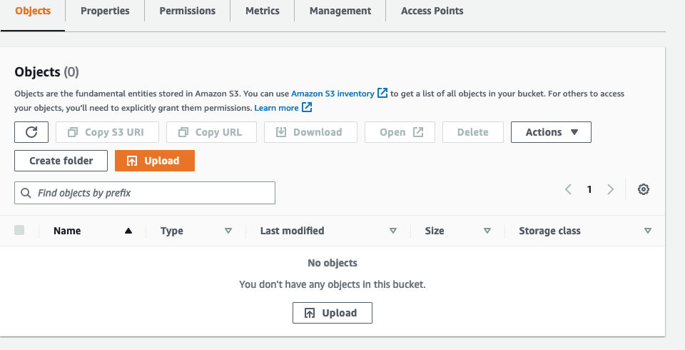
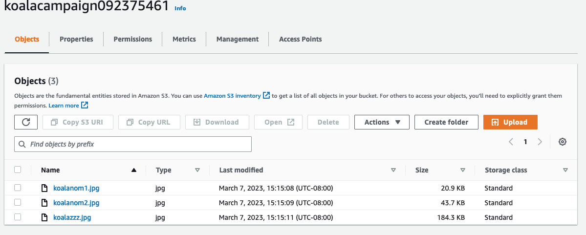
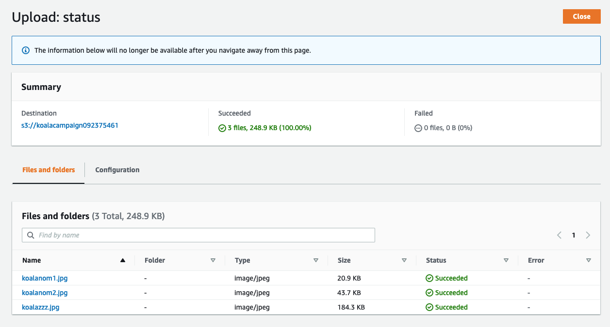

# S3 Buck First Instance


1. Go to the S3 console and then Buckets > Create bucket.
2. Give the bucket a unique name.  Remember, it must be unique globally. ```koalacampaign092375461```
3. Select a region
4. Will hit Object Ownership later


1. S3 buckets are private by default.  Only the general AWS account and the account root user have access.
2. You can grant access to all users, even unauthenticated users, but that's not a good idea.
3. Disabling the "Block all public access" doesn't give it public access.  It just means you can give it public access.


1. Get back to this later


1. Bucket created
2. Select the bucket


1. All resources in AWS have a unique identifyer: ARN.  They uniquely reference one resource within AWS.
    * arn: amazon resource name
    * aws: in most regions this will always say aws
    * s3: the service name

### Uploading files to S3 Bucket

1. Go to Objects then select Upload


1. You can upload files and folders


1. After a successful upload hit the close button    
2. We can create a folder for the images, but since this is a flat file system it doesn't really create a folder.  It's emulating a folder.  An object is being created.  Create a folder called "archive".