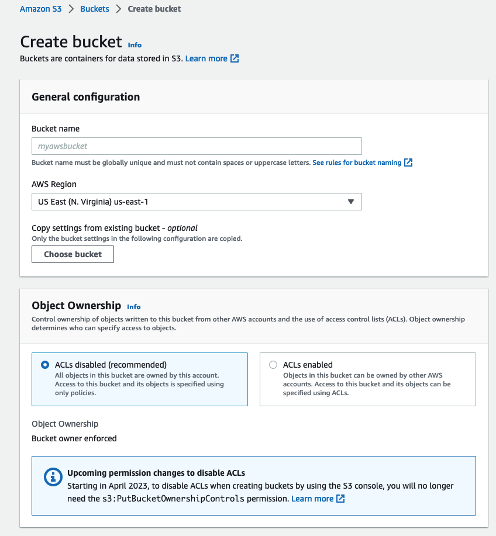

# S3 Buck First Instance


1. Go to the S3 console and then Buckets > Create bucket.
2. Give the bucket a unique name.  Remember, it must be unique globally. ```koalacampaign092375461```
3. Select a region
4. Will hit Object Ownership later