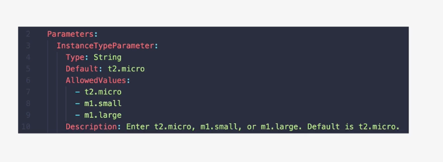
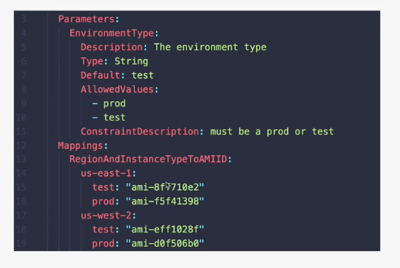

# CloudFormation Basics

CloudFormaton is a tool which lets you create, update, and delete infrastructure in AWS in a consistent and repeatable way using templates.     

1. At its base, CloudFormation uses templates. 
2. CloudFormation templates can create AWS infrastructure. Templates can also be updated and reapplied. 
3. Templates are written in either YAML or JSON.

## What makes a template?
1. All templates have a list of Resources, at least one. This is what tells CloudFormation what to do.
2. If Resources are added, then CloudFormation creates the resources. The same goes for updated, removed, etc. 
3. Resources is the only manditory part of a CloudFormation
4. Description: the author can describe what's going on.  Only gotcha is that the description must follow the AWSTemplateFormateVersion if it exists.
5. AWSTemplateFormateVersion. This is used to allow the extending of standards over time. If you don't put it in, AWS will just assume its value.
6. Metadata: This does many things
    * It can control how the different things in the CloudFormation template are presented through the console UI, so through the AWS console if you're applying it. You can specify groups, control the order, add descriptions to labels, etc. 
    
7. Parameters is where can add fields to prompt the user for more information. Drop downs and so forth will appear for the user to select from.
    * Could ask the user what size of instance to use, the name of something, the number of AZs to use, etc.
    
8. Mappings can be used for key/value lookup tables
    * An optional section
    
9. Conditions allow decision making in a template.  Only certain things will happen if a condition is met. It is a two step process.
    * Create the condition.  
    * If true, the condition is acted upon.

10. Outputs.  Once the template is finished, it can present outputs based on what has been created, updated, whatever. 

## Using Templates
