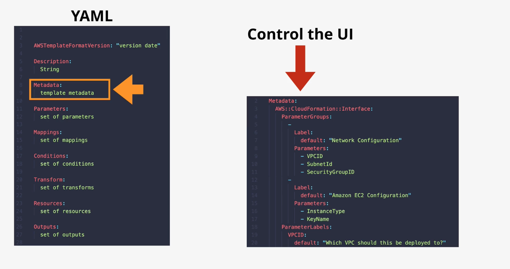
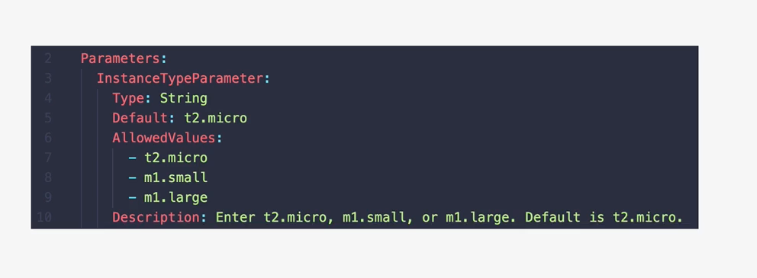
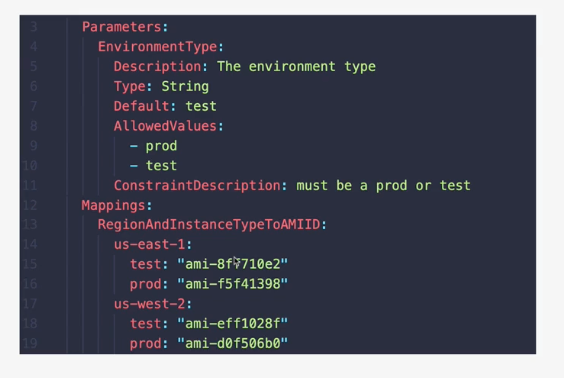
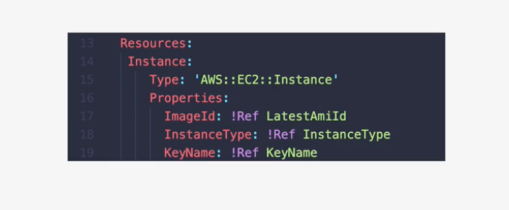

# CloudFormation Basics

CloudFormaton is a tool which lets you create, update, and delete infrastructure in AWS in a consistent and repeatable way using templates.     

1. At its base, CloudFormation uses templates. 
2. CloudFormation templates can create AWS infrastructure. Templates can also be updated and reapplied. 
3. Templates are written in either YAML or JSON.

## What makes a template?
1. All templates have a list of Resources, at least one. This is what tells CloudFormation what to do.
2. If Resources are added, then CloudFormation creates the resources. The same goes for updated, removed, etc. 
3. Resources is the only manditory part of a CloudFormation
4. Description: the author can describe what's going on.  Only gotcha is that the description must follow the AWSTemplateFormatVersion if it exists.
5. AWSTemplateFormatVersion. This is used to allow the extending of standards over time. If you don't put it in, AWS will just assume its value.
6. Metadata: This does many things
    * It can control how the different things in the CloudFormation template are presented through the console UI, so through the AWS console if you're applying it. You can specify groupings, control the order, add descriptions to labels, etc. 
    
7. Parameters is where can add fields to prompt the user for more information. Drop downs and so forth will appear for the user to select from.
    * Could ask the user what size of instance to use, the name of something, the number of AZs to use, etc.
    
8. Mappings can be used for key/value lookup tables
    * An optional section
    
9. Conditions allow decision making in a template.  Only certain things will happen if a condition is met. It is a two step process.
    * Create the condition.  
    * If true, the condition is acted upon.

10. Outputs. Once the template is finished, it can present outputs based on what has been created, updated, whatever. 

## Using Templates
1. This example is a template creates an EC2 instance

2. Resources inside a CloudFormation are called logical resources.  The logical resource in this case is called ```instance```.  
    * A logical resource has a Type.  It's the type that lets CloudFormation know what it has to create.
    * Logical resources typically have Properties that CF uses to configure the resources.
    * When you give CF a template, it creates a stack. The stack contains all of the logical resources that the template tells it to contain.
    * One template could create 1 or more stacks. 
    * !! for any logical resources in the stack, CF makes a corresponding physical resource in your AWS account. So in this example, we have a call for an EC2 instance. The physical resource is the actual EC2 instance which CF creates.  ```It's CFs job to keep the logical and physical resources in sync```.
    * So when you use a template to create a stack, CF will scan the template, create a stack with logical resources inside and then create physical resources which match. 
    * You can also take a template, update it, and then use it to update that same stack. 
    * If the logical resources have been completely removed from the template, the stack will update resulting in a deletion of the physical resources. 
    * CF lets you automate infrastructure.
    * CF can also be used as part of change management.  You can store templates in source code reponsitories, add changes, get approval, and do all of this before applying them.
    * They can be used to spin up one off deployments.
