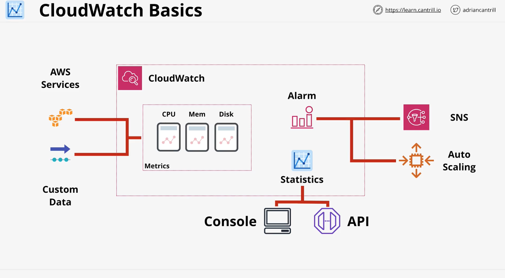

# Cloud Watch
It is a support service used by almost all other AWS services. 

It performs three main jobs:
1. It collects and manages operational data on your behalf.  
2. Any data about an environment by detailing how it performs, how it normally runs.
3. Or any logging data that it generates.

## Three products in one
1. Metrics: AWS Products, Apps, on-premises. It allows the collection of metrics, monitoring of metrics and actions based on metrics
    * Metrics are simply data relating to AWS Products, Apps, and on-premises systems.  For example, CPU uses of EC2 instances, disc space useage for on-premises servers, or maybe the number of visiters per second to a website.
    * CW is a public service so it can be used for metric gathering, either inside AWS, within on-premises environments, or even within other cloud platforms. If you have a public Inet connection and permissions to add data to CW, it can be used from almost anywhere. 
    * One aspect of CW that you'll need to learn pretty quickly is that some metrics are gathered natively by the product. So generally, anything running in AWS, anything which is visible from within a product can be handled natively. For example, looking at CPU utilization on an EC2 instance, that's done by default. Also monintoring other things inside products which aren't exposed to AWS needs the AWS Agent. For example, if you want to monitor which processes are running on an EC2 instance, or the memory untilization of those processes, you'll need to install the CloudWatch Agent.
    * Whatever method you use CW gathers and stores this data.  It gives you a UI, a command line interface, or an API interface to access that data.
2. CloudWatch Logs. AWS Products, Apps, on-premises. It allows for the collection, monitoring and actions based on logging data. Almost anything that creates logs can be injested by CW Logs. Now as with the parent CW product for on-premises infrastructure, custom logs, or anything outside of what's exposed to AWS natively, then you'll need to install the CW agent. 
3. CloudWatch Events. AWS Services & Schedules. This functions as an event hub.  CW Events provides two powerful features.
    * If an AWS service does something, maybe an EC2 instance is terminated, started, or stopped, the CW Events will generate an event which can perform another action.
    * It can also generate events to do something a certain day or certain days of the week. 



### Name space
1. Think of name space as a container for monitoring data. It's a way to keep things from becoming messy. 
2. NS can have a name and they can be almost anything as long as it follows the rule sets. 
3. One exception. All AWS data goes into an AWS namespace called ```AWS/service```
4. NS contain related metrics. 
    * a metric is a collection of related data points in a time ordered structure
        1. cpu utilization
        2. network in/out
    * a metric is not for a specific server. it might be receiving data from lots of EC2 instances. We need a way of identifying which things log data.