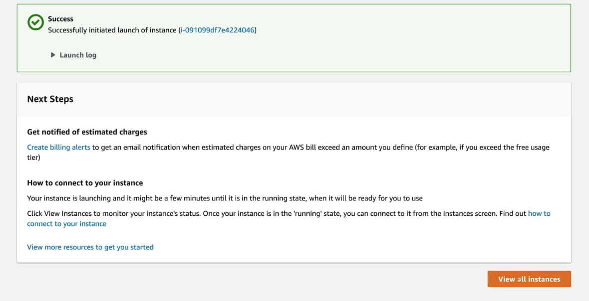

# CloudWatch Test

### Advanced Settings
1. Detailed CloudWatch monitoring set to enable.  Additional charges apply.

2. When done with settings scroll to bottom and select launch instance.  It will take a few minutes to run.
3. Select view all instances

4. When status check is 2/2, run a search for CloudWatch

5. CloudWatch Dashboard > Alarms 

6. All alarms > Create alarm

7. Select metric

8. Now look for EC2.  The CPU Utilize metric is inside the EC2 name space.

9. Per-Instance Metrics

10. This will show app of the pre-instance metrics we currently have.  Scroll until you find CPUUtilization. Check the box, then select metric button

11. Specify metric and conditions
