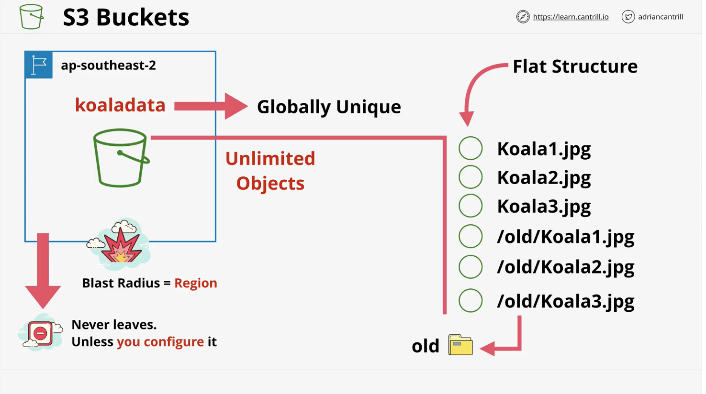

# S3 Basics
1. Global storage platform - regional based/resilient     
    * It's a public service that can be accessed anywhere with an internet connection
    * It's region based b/c your data is stored in a specific AWS region.
    * It never leaves that region unless you specifically set it up to do so.
    * It's regionally resilient b/c the data is replicated across that region.
2. It's a public service, unlimitted data & multi-user (in the millions) can access it
3. It's perfect for hosting large amounts of data (e.g., movies, audio, photos, lrg data sets, etc)
4. Economical & accessed via UI/CLI/API/HTTP
5. It should be the default starting point for storing data
6. S3 has two main things it delivers: Objects & Buckets
    * Objects: pictures, movies, large stores of data sets
    * Buckets: containers for objects

## Objects
 
 1. Think of objects as files. They have two main components and some meta data.
 2. The key identifies the object in the bucket. 
 3. The vale is the data or contents of the boject. !! The value can range for 0 bytes to 5TB.

 ## Buckets
 
 1. Buckets are created in a specific AWS region.  This has two main impacts.
    * First, the data inside the bucket has a primary home region.  It never leaves the region unless you set it up to do so.  This means S3 has stable and controlled sovereignty. 
    * In the event of a catastrophy, the effects will be contained w/in that region.
    * !! A bucket name needs to be globally unique across all regions and all AWS accounts
    * They can hold unlimitted objects.  Infinately scalable storage system.
    * !! As an object storage system, S3 buckets have no complex structure. It's flat.  All objects are stored at the same level.
    * Folders are often referred to as prefixes in S3. They're not part of the object name, the prefix the object names.
    * Buckets are generally the default place you should go to to configure the way that S3 works.